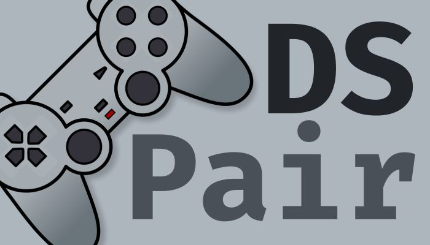

# DSPair - Windows Version

> Conecte seu DualShock 4 com facilidade ao Windows.

## Sobre o projeto

DSPair é um projeto simples, em desenvolvimento, feito para solucionar demandas de projetos que implementam controles DS4 que necessitam de pareamento automático no SO Windows.
De forma simples e direta, você pode parear e desparear controles próximos ou através de seu MAC, iniciando também o serviço HID para comunicação com o sistema.

### Recursos

- [x] Parear via MAC Address
- [x] Desparear via MAC Address
- [x] Listar todos os dispositivos compatíveis próximos
- [x] Listar todos os dispositivos compatíveis já pareados

### Ajustes e melhorias

O projeto ainda está em desenvolvimento e próximas atualizações serão voltadas nos seguintes recursos:

- [ ] Bugs menores...

## ☕ Usando o DSPair

Para utilizar o DSPair, você precisa iniciar o seu executável (disposnível em sua pasta `./bin`).
Note que a aplicação se baseia em API Rest e é necessário acessar seus end-points para executar as suas funcionalidades.

### End-points

Os end-points estão documentados utilizando o Swagger. Para obter a lista, basta acessar acessar a seguinte url a partir de seu navegador:
> `http://localhost:5000/swagger` - considerando a porta padrão e ambiente local

## 🤝 Reconhecimentos aos colaboradores

* [Daniel Amaral](https://github.com/danamaral92)
* [Gabriel Trindade](https://github.com/GabrielTrindade31)

## 🙋🏾‍♂️ Autor

* [Igor Oliveira](https://github.com/reedbluue) - Just another person

## 📝 Licença

Esse projeto está sob licença. Veja o arquivo [LICENÇA](./LICENSE) para mais detalhes.